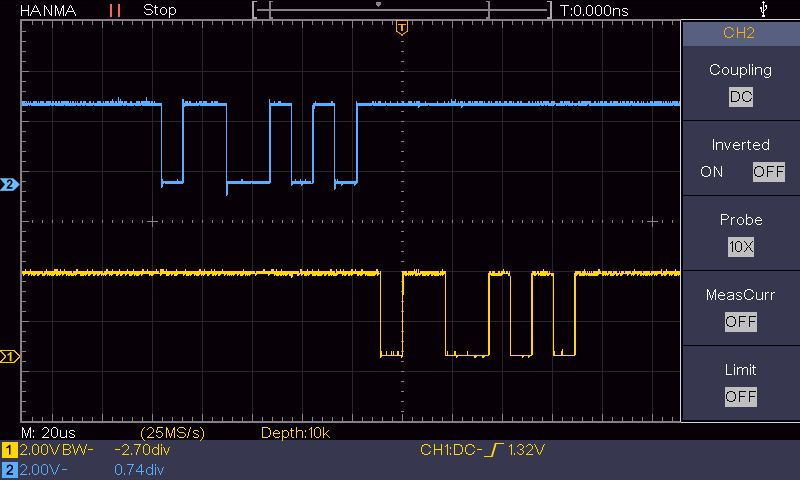
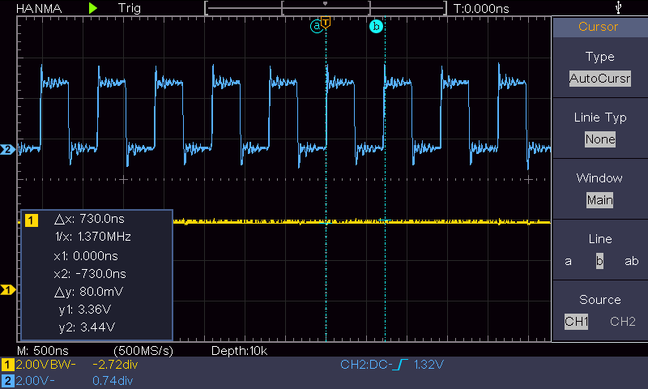

This is a bare-metal USART project for the NXP LPC55S06-EVK. The evaluation board is connected to a Windows 11 PC via a USB-to-UART adapter.
The firmware receives characters from the PC via the UART and echoes them back to the PC.

The communication settings are:
- 115200 baud
- 8 data bits
- 1 stop bit
- No parity





No overflow can occur in echo mode

Measured loop time (Release -O3, 96 MHz core): 365 ns per polling iteration.
Character period at 115200 baud, 8N1:          86.8 us.
Margin:                                        ~240x on the idle path,
                                               ~110x including the echo work.

```c
  while (1) {
    uint8_t b;
    GPIO->NOT[0] = (1UL << 9);
    if (UART_read_char(&b)) {
      UART_write_char(b);
    }
  }
```




| Function | Connector | Connector Pin |
|----------|-----------|---------------|
| Rx       | J3        | 1             |
| Tx       | J3        | 2             |
| GND      | J3        | 3             |

Jumper JP9 must be closed.
Jumper JP12 must be open.


Hardware

LPC55S06-EVK: https://www.nxp.com/design/design-center/software/development-software/mcuxpresso-software-and-tools-/lpcxpresso-boards/lpcxpresso-development-board-for-lpc55s0x-0x-family-of-mcus:LPC55S06-EVK

UART-Adapter: https://www.az-delivery.de/en/products/ftdi-adapter-ft232rl
