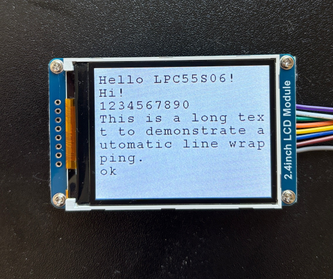

This is a bare-metal USART project for the NXP LPC55S06-EVK. The evaluation board is connected to a Windows 11 PC via a USB-to-UART adapter.
The firmware receives characters from the PC via the UART and displays them on the Waveshare ILI9341 LCD.

The communication settings are: 115200 8N1

| Function | Connector | Connector Pin |
|----------|-----------|---------------|
| Rx       | J3        | 1             |
| Tx       | J3        | 2             |
| GND      | J3        | 3             |

Jumper JP9 must be closed.
Jumper JP12 must be open.

Hardware

LPC55S06-EVK: https://www.nxp.com/design/design-center/software/development-software/mcuxpresso-software-and-tools-/lpcxpresso-boards/lpcxpresso-development-board-for-lpc55s0x-0x-family-of-mcus:LPC55S06-EVK

UART-Adapter: https://www.az-delivery.de/en/products/ftdi-adapter-ft232rl

LCD: https://www.waveshare.com/wiki/2.4inch_LCD_Module?srsltid=AfmBOoqtv3bq-mZfPtsi2BxiewwQnIkomXrloIzpVwGw_HnrOcmvQZar