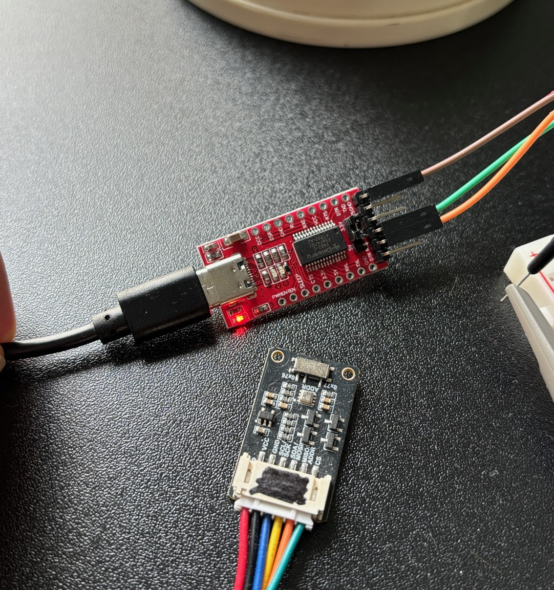
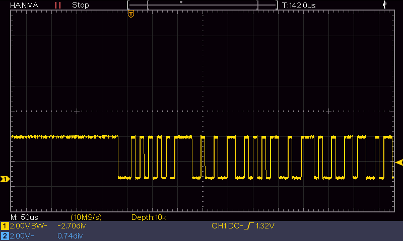
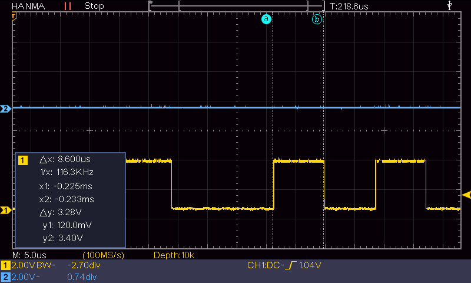
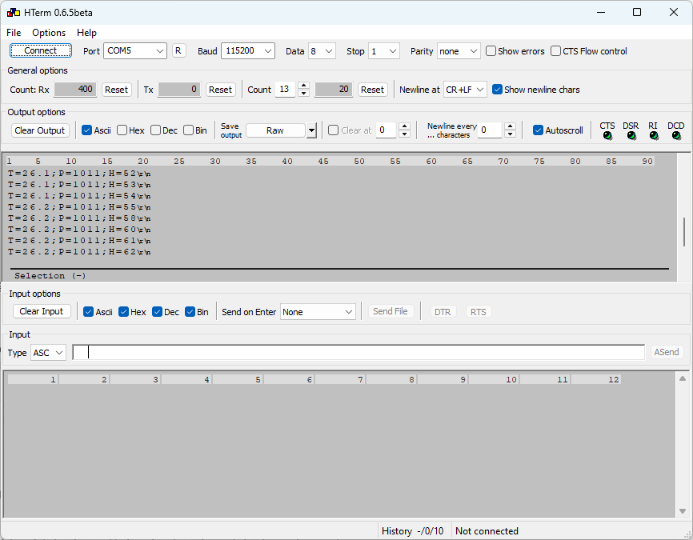

This is a bare-metal USART project for the NXP LPC55S06-EVK. The evaluation board is connected to a Windows 11 PC via a USB-to-UART adapter. The firmware transmits the text "Hello LPC55S06\r\n" every two seconds. On the PC, the terminal program HTerm receives and displays the data.

You can use any other terminal program. The communication settings are:

- 115200 baud
- 8 data bits
- 1 stop bit
- No parity

| Function | Connector | Connector Pin |
|----------|-----------|---------------|
| Rx       | J3        | 1             |
| Tx       | J3        | 2             |
| GND      | J3        | 3             |

Jumper JP9 must be closed.
Jumper JP12 must be open.

Hardware

LPC55S06-EVK: https://www.nxp.com/design/design-center/software/development-software/mcuxpresso-software-and-tools-/lpcxpresso-boards/lpcxpresso-development-board-for-lpc55s0x-0x-family-of-mcus:LPC55S06-EVK

UART-Adapter: https://www.az-delivery.de/en/products/ftdi-adapter-ft232rl

